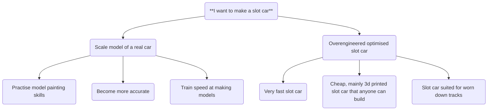

## The Precision of a Goal
People say "Split up very difficult goals into smaller manageable tasks!" but I believe that stage overlooks the importance of fully defining a goal. 

See how a single goal can mean so many different things? Defining the goal is the first step.

My goal is to design my own slot car, using hardware I have available (M3 bolts, 3d printer, assorted electronics) that's suited for worn down tracks.

>[!cite] Inner Motive
>I want to use this project as a way to improve my ability at integrating 3d printing with electronics and fasteners.

## SMART Goals
Now that there is a goal, it can be split into different steps. To do this, we've been told to use the acronym 'SMART;' **Specific. Measurable. Achievable. Realistic. Timebound**. Our goal must be **specific,** as I 