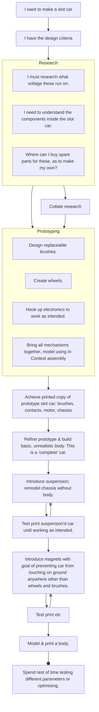

>"I need a plan of what to do" [[content/AIF 2026/project-plan|(for AIF)]]

Which means..? I'm not sure how I plan to go around writing documentation (such as these notes) while feeling like I'm able to see where I've taken a step in the right direction.

Today was a good day. I spoke with my speech pathologist about how I structure my work. I showed them my draft from recent schoolwork and spoke about how I go about completing an assignment. (such as an essay, response, etc.) I learnt a lot about how a scaffold works for me. Schoolwork gives me a specific task to do. I digest the content then answer the task. The format that tasks should be answered is difficult for me to understand.

>[!question]- For non South Australians
>The South Australian Certificate of Education (SACE) has strict rules on what types of tasks must be completed by students. Because SACE assignments are specific, the rubrics and task sheets are too. I am lucky to have this level of structure in my schoolwork; my parents tell me it was a lot more vague 20-30 years ago!

Schoolwork is a task because you have to take what you learnt before reexplaining it. This becomes difficult when you want to understand the content deeply, because then there likely isn't time to explain it. An extra difficulty for myself is to do this alongside fulfilling the requirements of the task.

# Optimising my time spent 'explaining'
I think that creating a template that I can fill in may serve a good starting point. Something like this that I can insert whenever I have class time free. Although unpolished I believe it will form a good base to consistently pump out articles from.

>[!example]
>## Summary
>"Today I modelled \[\_\_\_\_\]. I'm satisfied/not happy with the result..."
>"I did a test print of \[\_\_\_\_\] and I think I could..."
>"I had a conversation with \[\_\_\_\_\] and I learnt quite a bit, like how..."
> ## \<event\>
> // An event will be defined as a process I did, a conversation I had or an action that was (at least somewhat) a significant step of progress towards reaching my goal.
> ### NEOL
>// Images, scanned documents (obfuscated for public) etc.
> ## \<event\>
>Lorum
>### NEOL
>Lorum
> ## Todo
>// A short writing of what I want to do next, what has to be done, or what I felt needs to be continued. Ideally to leave myself satisfied with what I *have* done without reaching a conclusion.

# A 'timeline' for the Project
I'm not confident giving myself a timeline of what needs to be completed. I love routine, yet I hate timers. How odd. Anyways, I believe a flowchart (however barebones) could lead onto a further refinement.

>[!warning] Warning: Jargon & Messiness



>[!tip]- Gannt Charts
>Apparently there's this calendar-thing called a 'Gannt chart' I found in mermaid.js options. Perhaps I will try to refine my thoughts into this form rather than keeping everything in a flowchart.
>```mermaid
>gantt
>        title A Gantt Diagram
>        dateFormat  YYYY-MM-DD
>        section Section
>        A task           :a1, 2014-01-01, 30d
>        Another task     :after a1  , 20d
>        section Another
>        Task in sec      :2014-01-12  , 12d
>        another task      : 24d
>
>```

