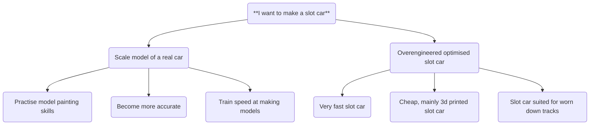

## The Precision of a Goal
People say "Split up very difficult goals into smaller manageable tasks!" but I believe that stage overlooks the importance of fully defining a goal. 

See how a single goal can mean so many different things?

